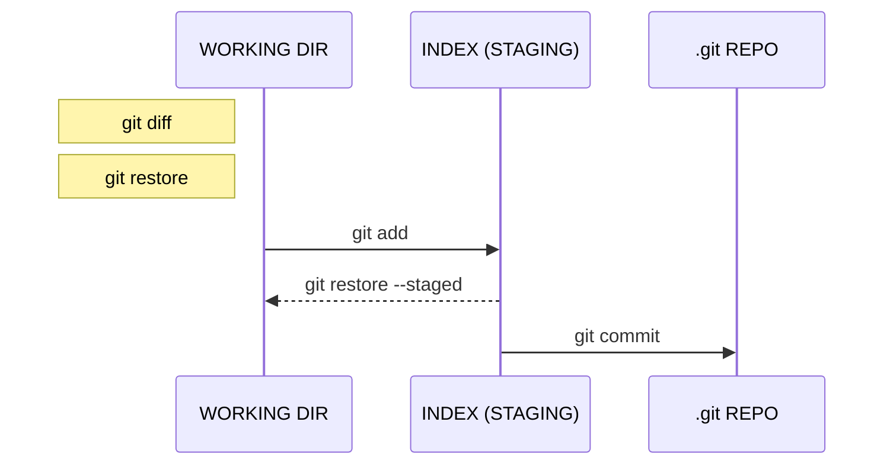

❗️WIP - il cheatsheet non è completo!
**per gli studenti: visitare [questo link](students/README.md)**

# GIT COURSE - CHEATSHEET ITA

Un riassunto dei comandi (e concetti) chiave di **_git_** rivolto a tutti, creato per gli studenti del mio corso.
Vito Vitale - Licenza MIT

# 0. Comandi base terminale

`ls -la` - visualizzazione dettagliata dei file nella cartella corrente

`touch NOME_FILE` - crea un file vuoto col nome specificato

`mkdir NOME_CARTELLA` - crea una cartella col nome specificato

`cd NOME_CARTELLA` - entra nella cartella specificata

`cd NOME_CARTELLA/NOME_SOTTOCARTELLA` - navigazione "annidata"

`cd ..` - torna alla cartella di livello immediatamente superiore

# 1. Inizializzazione

`git init` - inizializza un nuovo repository all'interno della cartella corrente

`git clone PROTOCOLLO@URL.REPOSITORY.REMOTO` - clona il repository remoto in una copia locale, contenuta all'interno di una cartella che avrà il nome del repo

# 2. Configurazione

## 2.1 Account

`git config --global user.name “NOME oppure USERNAME”`

> è possibile inserire il proprio nome e cognome oppure l'username utilizzato nel servizio di hosting (preferisco l'username)
>
> `git config --global user.email “la@propria.email”` (deve coincidere)

Il tag `--global` permetterà di salvare tali informazioni a livello globale di macchina, in modo da essere identificati in qualsiasi repo locale; se omesso, queste informazioni avranno validità solo nel repo corrente.

## 2.2 Alias

E' possibile creare _alias_ all'interno di git per comandi molto lunghi.
`git config --global alias.NOME_ALIAS "COMANDO GIT (SENZA GIT COME PREFISSO)"`

> alias visto a lezione per il log **oneline** e con **visualizzazione ramificata dei branch**:
> `git config --global alias.lg "log --graph --decorate --pretty=oneline --abbrev-commit --all --format=format:'%C(bold blue)%h%C(reset) - %C(bold green)(%ar)%C(reset) %C(white)%s%C(reset) %C(dim white)- %an%C(reset)%C(bold yellow)%d%C(reset)'"`

# 3. Operazioni locali

`git diff NOME_FILE` - visualizza le nuove modifiche da te apportate (stato **_modified_**)
`git restore NOME_FILE` 💣 - annulla le modifiche al file
`git add NOME_FILE` - porta il file dallo stato **_modified_** a **_staged_**

> è possibile specificare anche il nome di una cartella o un "risolutore"
> esempio: `git add .` - aggiunge all'**INDEX** tutti i file **_modified_** (non contenuti nel _.gitignore_)
>
> `git restore --staged NOME_FILE` - porta **indietro** il file dallo stato **_staged_** a **_modified_**
> `git commit -m"MESSAGGIO"` - aggiunge permanentemente i file **_staged_** al repo (**_committed_**)
