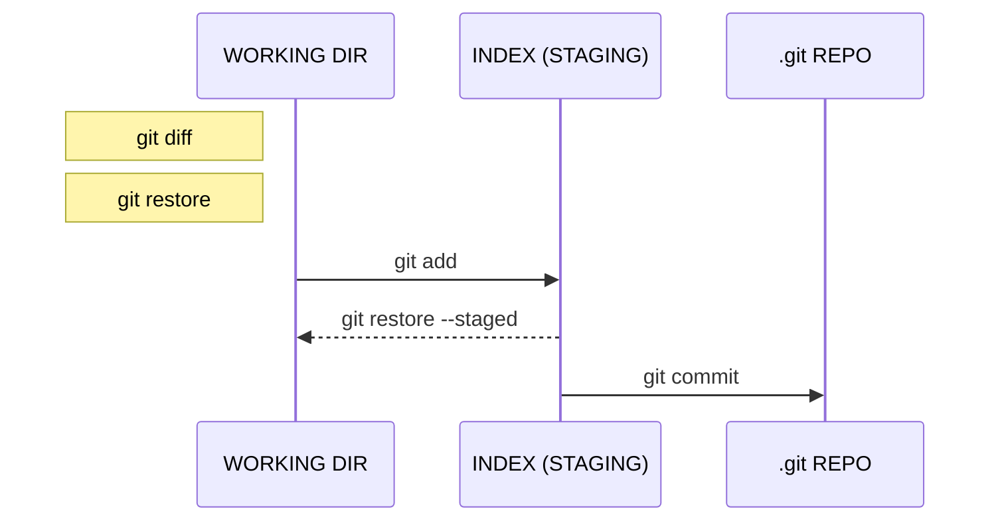

❗️WIP - il cheatsheet non è completo!
**per gli studenti: visitare [questo link](students/README.md)**

# GIT COURSE - CHEATSHEET ITA

Un riassunto dei comandi (e concetti) chiave di **_git_** rivolto a tutti, creato per gli studenti del mio corso.
Vito Vitale - Licenza MIT

Nel seguente documento sono presenti diagrammi creati utilizzando la sintassi **_mermaid_** non ancora supportata da Github. E' possibile comunque visualizzare correttamente tali diagrammi aggiungendo al proprio browser l'estensione open source [Github + Mermaid](https://github.com/BackMarket/github-mermaid-extension) (disponibile per Chrome e Firefox).

# 0. Comandi base terminale

`ls -la` - visualizzazione dettagliata dei file nella cartella corrente

`touch NOME_FILE` - crea un file vuoto col nome specificato

`mkdir NOME_CARTELLA` - crea una cartella col nome specificato

`cd NOME_CARTELLA` - entra nella cartella specificata

`cd NOME_CARTELLA/NOME_SOTTOCARTELLA` - navigazione "annidata"

`cd ..` - torna alla cartella di livello immediatamente superiore

# 1. Inizializzazione

`git init` - inizializza un nuovo repository all'interno della cartella corrente

`git clone PROTOCOLLO@URL.REPOSITORY.REMOTO` - clona il repository remoto in una copia locale, contenuta all'interno di una cartella che avrà il nome del repo

# 2. Configurazione

## 2.1 Account

`git config --global user.name “NOME oppure USERNAME”`

> è possibile inserire il proprio nome e cognome oppure l'username utilizzato nel servizio di hosting (preferisco l'username)

`git config --global user.email “la@propria.email”` (deve coincidere)

Il tag `--global` permetterà di salvare tali informazioni a livello globale di macchina, in modo da essere identificati in qualsiasi repo locale; se omesso, queste informazioni avranno validità solo nel repo corrente.

## 2.2 Alias

E' possibile creare _alias_ all'interno di git per comandi molto lunghi.
`git config --global alias.NOME_ALIAS "COMANDO GIT (SENZA GIT COME PREFISSO)"`

> alias visto a lezione per il log **oneline** e con **visualizzazione ramificata dei branch**:
> `git config --global alias.lg "log --graph --decorate --pretty=oneline --abbrev-commit --all --format=format:'%C(bold blue)%h%C(reset) - %C(bold green)(%ar)%C(reset) %C(white)%s%C(reset) %C(dim white)- %an%C(reset)%C(bold yellow)%d%C(reset)'"`

# 3. Operazioni locali

`git status` - visualizza i file in stato **_modified_** e **_staged_**

`git diff NOME_FILE` - visualizza le nuove modifiche da te apportate (stato **_modified_**)

`git restore NOME_FILE` 💣 - annulla le modifiche al file

`git add NOME_FILE` - porta il file dallo stato **_modified_** a **_staged_**

> è possibile specificare anche il nome di una cartella o un "risolutore"
> esempio: `git add .` - aggiunge all'**INDEX** tutti i file **_modified_** (non contenuti nel _.gitignore_)

`git restore --staged NOME_FILE` - porta **indietro** il file dallo stato **_staged_** a **_modified_**

`git diff --staged` - visualizza le nuove modifiche in stato **_staged_** (e non ancora committate)

`git commit -m"MESSAGGIO"` - aggiunge permanentemente i file **_staged_** al repo (**_committed_**)

`git commit --amend -m"NUOVO MESSAGGIO"` - permette di modificare il contenuto e il messaggio dell'ultimo commit (i file messi subito prima in **_staged_** verranno aggiunti all'ultimo commit)

# 4. Branching

`git branch` - visualizza la lista di tutti i branch (il branch corrente sarà contrassegnato dal `*`)

`git branch NOME_NUOVO_BRANCH` - crea un nuovo branch a partire dall'ultimo commit

`git checkout NOME_BRANCH` - entra nel branch specificato (verrà copiato nella **_WORKING DIR_**)

`git checkout -b NOME_NUOVO_BRANCH` - crea ed entra nel branch specificato (verrà copiato nella **_WORKING DIR_**)

`git merge NOME_BRANCH_DA_UNIRE` - unisce il branch specificato nel branch corrente

`git log` - visualizza tutti i commit apparententi alla storia dei branch

# 5. Sincronizzazione repository remoto

`git remote -v` - visualizza la lista di **_collegamenti_** attivi fra il repository locale e il repository remoto

`git remote add NOME_COLLEGAMENTO URL.REPOSITORY.REMOTO` - crea un nuovo collegamento all'url del repository remoto specificato (utile dopo una **_fork_** per collegarsi al repo originale - **_UPSTREAM_**)

`git fetch [NOME_COLLEGAMENTO]` - scarica tutti i branch nel repo locale dal collegamento specificato (**_origin_** se non specificato), senza modificare la **_WORKING DIR_**

`git pull [NOME_COLLEGAMENTO] [NOME_BRANCH]` - esegue la **_fetch_** sincronizzando il repo locale, scaricando tutte le modifiche e modificando la **_WORKING DIR_** (parametri facoltativi)

`git push [NOME_COLLEGAMENTO] [NOME_BRANCH]` - invia tutti i commit (nuovi) presenti nel repo locale al repo remoto, al branch specificato (parametri facoltativi se abbiamo utilizzato il flag `--set-upstream`)

`git push --set-upstream [NOME_COLLEGAMENTO] [NOME_BRANCH]` - utile al primo push di un nuovo branch locale nel repo remoto (dal momento successivo sarà possibile effettuare le operazioni **_fetch_**, **_pull_** e **_push_** senza specificare gli argomenti aggiuntivi)

# 6. Modifiche temporanee (STASH)

`git stash` - salva localmente (nell'area di stash) l'attuale stato della **_WORKING DIR_** e dell'**_INDEX_**

`git stash list` - visualizza tutti gli stash salvati in precedenza

`git stash apply` - applica l'ultimo stash alle **_WORKING DIR_** e **_INDEX_**

`git stash drop` - cancella l'ultimo stash presente nell'area

# 7. Sovrascrivere la storia (WIP)

`git rebase NOME_BRANCH`

`git reset --hard COMMIT_ID`